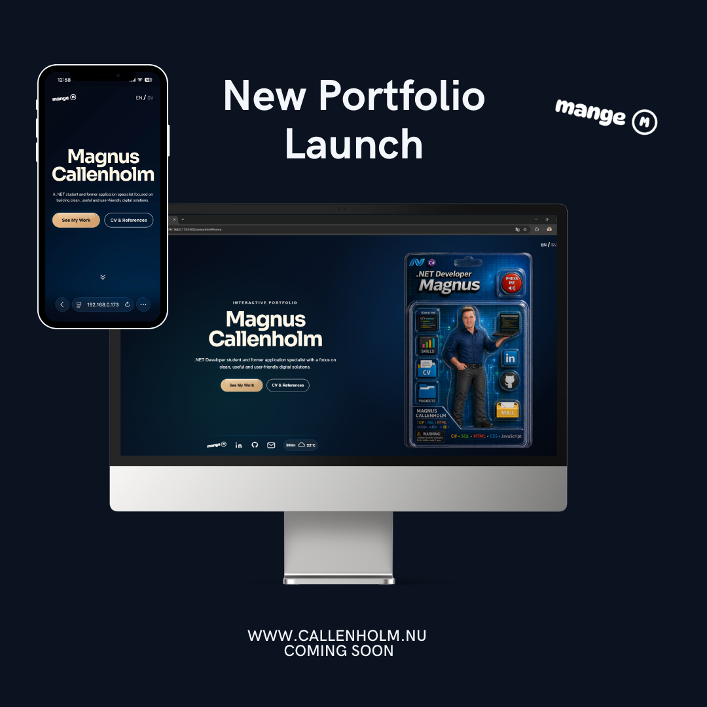

# Interactive Portfolio – Magnus Callenholm

This is my interactive portfolio project, built with HTML, CSS and JavaScript.

The portfolio is designed as an interactive action figure package where the user can explore sections such as About Me, Skills, CV, Projects and Contact. The project was created as part of my front-end development studies and focuses on responsive design, interactivity and a clean, user-friendly experience.

## Preview



The portfolio is responsive and designed to work on both mobile and desktop devices.

## Features

- Interactive action figure package navigation
- Responsive mobile and desktop layout
- About Me section
- Skills section
- CV and references section
- Project showcase with detailed project views
- Contact form
- Weather widget using API
- Press Me button with audio greeting
- Footer with social links

## Methods and principles used

### Mobile-first design
The project was built with a mobile-first approach. The base layout was first created for smaller screens and later adapted for desktop using media queries.

### Responsive design
The portfolio is responsive and adapts to different screen sizes by using:
- CSS media queries
- flexible sizing with rem, clamp() and percentages
- separate desktop layout adjustments

### CSS Grid and Flexbox
Both Grid and Flexbox were used throughout the project:
- Grid for larger layout structure
- Flexbox for alignment, spacing and smaller interface groups

### Semantic HTML
Semantic HTML elements such as `main`, `section`, `footer`, `button`, `form` and proper heading hierarchy were used to create a clear and structured layout.

### JavaScript interactivity
JavaScript was used to handle:
- section switching
- card flipping interactions
- project detail views
- button events
- audio playback for the “Press Me” button
- page/view state changes through CSS classes

### Reusable styling
Reusable classes and shared styling patterns were used to keep the design consistent across sections.

### Version control with Git and GitHub
The project was developed using Git and GitHub with:
- feature branches
- structured commits
- merge workflow into main

### User experience focus
A strong focus was placed on:
- clear navigation
- visual clarity
- responsive presentation
- interactive but understandable user flow

### API integration
A weather widget was implemented in the footer using weather API data.

### Form handling
The contact form allows visitors to send a message and redirects them to a thank-you page after submission.

## Built with

- HTML5
- CSS3
- JavaScript
- OpenWeather API
- FormSubmit
- Git
- GitHub

## Project structure

```text
assets/
  sounds/
  documents/
  icons/
  images/
css/
  style.css
  responsive.css
  animations.css
js/
  main.js
  weather.js
  form.js
index.html
thanks.html
README.md


